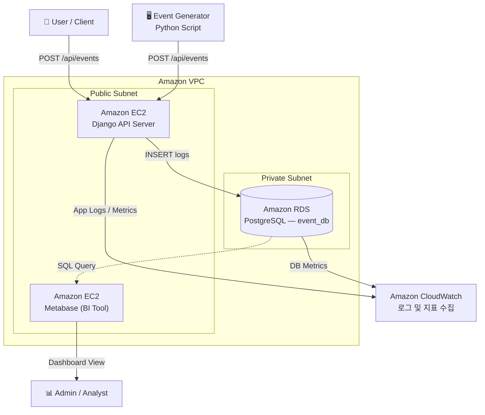

# EventShop — 이벤트 로그 데이터 파이프라인

e-commerce 환경의 사용자 행동 로그를 생성하고, 저장하고, 분석하여 시각화하는 엔드-투-엔드 데이터 파이프라인입니다.
`docker compose up` 한 번으로 전체 스택이 실행됩니다.

## Tech Stack

| 역할 | 기술 |
|---|---|
| API 서버 | Django, Django REST Framework |
| 데이터베이스 | PostgreSQL 15 |
| 이벤트 생성기 | Python (가중치 기반 랜덤 생성) |
| 시각화 (BI) | Metabase |
| 인프라 | Docker, Docker Compose |

---

## 빠른 시작

**사전 조건:** Docker 및 Docker Compose가 설치되어 있어야 합니다.

```bash
# 전체 스택 실행 (API 서버, DB, 이벤트 생성기, Metabase)
docker compose up --build -d
```

| 서비스 | 주소 |
|---|---|
| Swagger API 문서 | http://localhost:8000/api/docs/ |
| Metabase 대시보드 | http://localhost:3000 |

실행 직후 이벤트 생성기가 자동으로 동작하며, DB에 데이터가 적재됩니다.

---

## 스키마 설계

### `events` 테이블

```sql
CREATE TABLE events (
    id          UUID        PRIMARY KEY,
    user_id     UUID        NOT NULL,
    event_type  VARCHAR(50) NOT NULL,
    timestamp   TIMESTAMPTZ NOT NULL,
    payload     JSONB
);

CREATE INDEX idx_events_event_type ON events(event_type);
CREATE INDEX idx_events_timestamp  ON events(timestamp);
CREATE INDEX idx_events_user_id    ON events(user_id);
```

**스키마 선택 이유**

집계와 필터링이 자주 발생하는 컬럼(`event_type`, `timestamp`, `user_id`)은 정형 컬럼으로 분리하고 인덱스를 부여해 조회 성능을 높였습니다. 반면 이벤트별로 구조가 달라지는 상세 데이터(검색어, 상품 ID, 구매 금액 등)는 `payload JSONB`에 담아, 새로운 이벤트 타입이 추가되어도 스키마 마이그레이션 없이 유연하게 확장할 수 있도록 했습니다.

---

## 이벤트 설계

실제 트래픽 비율을 반영한 4가지 이벤트를 가중치 기반으로 생성합니다.

| 이벤트 타입 | 생성 비율 | payload 주요 필드 |
|---|---|---|
| `page_view` | 50% | `page`, `referrer` |
| `search` | 30% | `keyword`, `result_count` |
| `purchase` | 15% | `product_id`, `price`, `quantity` |
| `purchase_limited` | 5% | `product_id`, `price`, `is_limited` |

가중치 없이 단순 랜덤으로 생성하면 실제 서비스에서 거의 발생하지 않는 이벤트(한정판 구매 등)가 과도하게 생성되어, 분석 결과가 현실과 괴리됩니다. `random.choices(weights=[...])` 를 사용해 현실적인 데이터 분포를 시뮬레이션했습니다.

상품 ID는 일반 상품(`1001~`)과 한정판 상품(`5000~`)으로 네임스페이스를 분리했습니다. 이렇게 하면 별도 테이블 JOIN 없이 ID 범위만으로도 상품 유형을 즉시 구분할 수 있어 집계 쿼리가 단순해집니다.

---

## 데이터 분석 쿼리

`analysis.sql`에 전체 쿼리가 포함되어 있습니다.

**1. 이벤트 타입별 발생 비율**

```sql
SELECT
    event_type,
    COUNT(*)                                           AS count,
    ROUND(COUNT(*) * 100.0 / SUM(COUNT(*)) OVER (), 2) AS percentage
FROM events
GROUP BY event_type
ORDER BY count DESC;
```

**2. 일반 상품 vs 한정판 상품 매출 비교**

```sql
SELECT
    CASE
        WHEN (payload->>'product_id')::int >= 5000 THEN '한정판'
        ELSE '일반'
    END AS product_type,
    COUNT(*)                              AS order_count,
    SUM((payload->>'price')::numeric)     AS total_revenue,
    AVG((payload->>'price')::numeric)     AS avg_price
FROM events
WHERE event_type IN ('purchase', 'purchase_limited')
GROUP BY product_type;
```

**3. 실시간 인기 검색어 Top 5**

```sql
SELECT
    payload->>'keyword' AS keyword,
    COUNT(*)            AS search_count
FROM events
WHERE event_type = 'search'
GROUP BY keyword
ORDER BY search_count DESC
LIMIT 5;
```

---

## 시각화

Metabase(http://localhost:3000)에서 위 쿼리를 기반으로 아래 3개의 차트를 구성했습니다.

- 이벤트 타입별 트래픽 분포 — 파이 차트
- 일반 vs 한정판 매출 비교 — 이중 축(Dual-Axis) 바 차트
- 실시간 인기 검색어 Top 5 — 테이블

> 매출액(수백만 원)과 주문 건수(수십 건)를 같은 축에 그리면 건수 데이터가 거의 보이지 않는 문제가 있었습니다. Y축을 좌/우로 분리하는 이중 축 설정을 적용해 두 지표를 하나의 차트에서 비교할 수 있도록 개선했습니다.

---

## 구현하면서 고민한 점

**UUID vs Auto-increment**
여러 서버 또는 컨테이너에서 동시에 이벤트를 수집하는 파이프라인 특성상, DB 시퀀스에 의존하는 Auto-increment는 병목을 유발할 수 있습니다. `event_id`와 `user_id` 모두 UUID v4를 채택하여, 분산 환경에서도 DB를 거치지 않고 클라이언트 측에서 ID를 생성할 수 있도록 했습니다.

**Docker 컨테이너 간 네트워크**
초기 개발 시, 생성기 스크립트에서 DB 접속 시 `localhost`를 사용해 `Connection Refused` 에러가 발생했습니다. Docker 컨테이너 내부의 `localhost`는 자기 자신을 가리키기 때문에, `docker-compose.yml`에 선언된 서비스명(`db`)을 호스트명으로 사용하도록 수정해 해결했습니다.

**환경변수 누락으로 인한 IP 오파싱**
`settings.py`에서 `POSTGRES_HOST` 환경변수 매핑이 누락된 상태로 실행하자, DB 연결 시 `0.0.21.56`이라는 알 수 없는 IP로 연결을 시도하는 에러가 발생했습니다. 포트 번호 `5432`가 호스트 자리로 들어가면서 32비트 정수로 강제 변환된 결과였습니다. 이를 계기로 서비스 실행 시 환경변수 주입 여부를 검증하는 습관을 갖게 됐습니다.

---

## 프로젝트 구조

```
.
├── docker-compose.yml
├── generator/
│   └── generate_events.py   # 이벤트 생성기
├── api/
│   ├── settings.py
│   └── ...                  # Django 앱
├── sql/
│   └── analysis.sql         # 집계 분석 쿼리
└── README.md
```

---

## 선택 과제 B — AWS 아키텍처 설계

본 파이프라인(이벤트 생성 → 저장 → 시각화)을 프로덕션 환경에서 운영한다고 가정했을 때의 AWS 아키텍처입니다.

### 아키텍처 구성도



### 사용 서비스 및 선택 이유

| 서비스 | 역할 | 선택 이유 |
|---|---|---|
| **Amazon EC2** | Django API 서버 및 Metabase 구동 | 현재 Docker 기반 구성을 그대로 이식할 수 있고, 인스턴스 타입 변경으로 유연하게 스케일업 가능 |
| **Amazon RDS (PostgreSQL)** | 이벤트 로그 영구 저장 | 자동 백업, Multi-AZ 고가용성, 보안 패치 등 DB 운영 부담을 AWS에 위임(Managed Service) 가능 |
| **Amazon VPC** | 네트워크 격리 | Public/Private Subnet을 분리해 RDS를 외부에 직접 노출하지 않고 보안 강화 |
| **Amazon CloudWatch** | 로그 및 지표 중앙 수집 | EC2와 RDS의 이상 징후를 한 곳에서 모니터링하고 알림 설정 가능 |

### 설계에서 가장 고민한 부분 — 컴퓨팅과 스토리지의 역할 분리

초기에는 EC2 하나에 Django, Metabase, PostgreSQL을 모두 올리는 방식을 고려했습니다. 구성이 단순하고 비용도 저렴하지만, 이벤트 로그가 지속적으로 쌓이는 파이프라인 특성상 스토리지 포화나 메모리 누수가 발생하면 DB와 애플리케이션이 함께 다운되는 단일 장애점(SPOF)이 생긴다는 문제가 있었습니다.

이를 해결하기 위해 컴퓨팅(EC2)과 스토리지(RDS)를 물리적으로 분리했습니다. API 서버에 장애가 생겨도 적재된 로그 데이터는 RDS에 안전하게 보존되고, 트래픽 급증 시 서버와 DB를 독립적으로 확장할 수 있습니다. 또한 RDS를 Private Subnet에 배치해 외부에서 직접 접근할 수 없도록 하고, CloudWatch로 두 리소스를 함께 모니터링함으로써 운영 가시성도 확보했습니다.